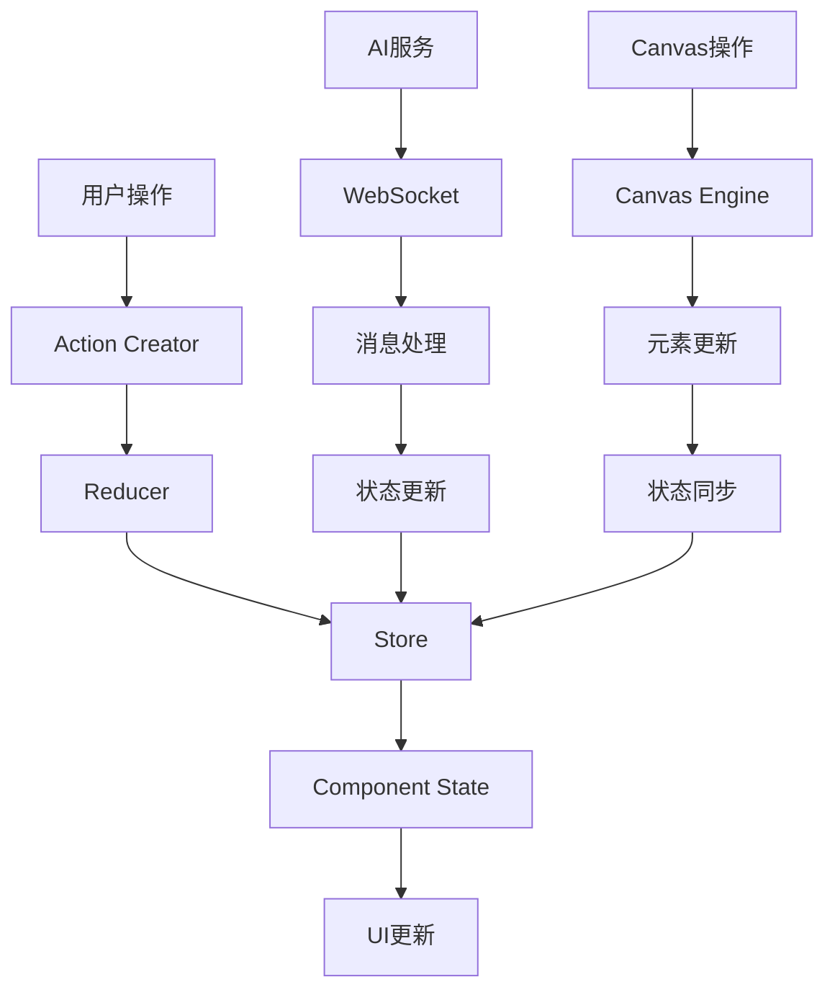

# Lovart Web 数字工作空间技术架构文档

## 项目概述

Lovart Web 是一个现代化的数字工作空间应用，集成了AI助手和创意工具，为用户提供智能化的内容创作和协作环境。

## 系统架构

### 整体架构图

```
┌─────────────────────────────────────────────────────────────┐
│                        前端应用层                            │
├─────────────────────────────────────────────────────────────┤
│  Canvas区域          │  AI对话面板        │  工具栏区域        │
│  - 画布渲染引擎      │  - 对话管理        │  - 工具面板        │
│  - 元素管理          │  - 消息处理        │  - 状态管理        │
│  - 交互处理          │  - AI集成          │  - 事件处理        │
└─────────────────────────────────────────────────────────────┘
┌─────────────────────────────────────────────────────────────┐
│                        状态管理层                            │
├─────────────────────────────────────────────────────────────┤
│  Canvas状态          │  对话状态          │  用户状态          │
│  - 元素状态          │  - 消息历史        │  - 用户信息        │
│  - 选择状态          │  - AI状态          │  - 权限状态        │
│  - 历史记录          │  - 生成状态        │  - 设置状态        │
└─────────────────────────────────────────────────────────────┘
┌─────────────────────────────────────────────────────────────┐
│                        服务层                               │
├─────────────────────────────────────────────────────────────┤
│  AI服务             │  文件服务          │  用户服务          │
│  - 图像生成          │  - 文件上传        │  - 认证授权        │
│  - 文本处理          │  - 文件存储        │  - 用户管理        │
│  - 对话管理          │  - 版本控制        │  - 权限控制        │
└─────────────────────────────────────────────────────────────┘
┌─────────────────────────────────────────────────────────────┐
│                        数据层                               │
├─────────────────────────────────────────────────────────────┤
│  本地存储            │  云端存储          │  缓存层            │
│  - IndexedDB         │  - 对象存储        │  - Redis           │
│  - LocalStorage      │  - 数据库          │  - 内存缓存        │
└─────────────────────────────────────────────────────────────┘
```

## 技术栈

### 前端技术栈

- **框架**: React 18+ / Next.js 14+
- **状态管理**: Zustand / Redux Toolkit
- **UI组件库**: Ant Design / Material-UI
- **画布渲染**: Fabric.js / Konva.js
- **样式方案**: Tailwind CSS / Styled Components
- **类型检查**: TypeScript
- **构建工具**: Vite / Webpack
- **代码质量**: ESLint + Prettier

### 后端技术栈

- **运行时**: Node.js 18+
- **框架**: Express.js / Fastify
- **数据库**: PostgreSQL / MongoDB
- **缓存**: Redis
- **文件存储**: AWS S3 / 阿里云OSS
- **AI服务**: OpenAI API / 自建模型
- **认证**: JWT + OAuth2.0

### 部署架构

- **容器化**: Docker + Docker Compose
- **编排**: Kubernetes
- **CDN**: CloudFlare / 阿里云CDN
- **监控**: Prometheus + Grafana
- **日志**: ELK Stack

## 核心模块设计

### 1. Canvas画布模块

#### 功能特性
- 多元素支持（文本、图片、形状、绘图）
- 实时协作编辑
- 版本历史管理
- 导出功能（PNG、PDF、SVG）

#### 技术实现
```typescript
// 画布状态管理
interface CanvasState {
  elements: CanvasElement[];
  selectedElement: string | null;
  viewport: Viewport;
  history: HistoryState[];
  collaborators: Collaborator[];
}

// 画布元素基类
interface CanvasElement {
  id: string;
  type: ElementType;
  position: Position;
  size: Size;
  style: ElementStyle;
  data: any;
}
```

### 2. AI对话模块

#### 功能特性
- 智能对话管理
- 图像生成集成
- 任务规划与执行
- 上下文记忆

#### 技术实现
```typescript
// 对话状态
interface ChatState {
  messages: Message[];
  currentTask: Task | null;
  aiStatus: AIStatus;
  generationQueue: GenerationTask[];
}

// 消息类型
interface Message {
  id: string;
  type: 'user' | 'assistant' | 'system';
  content: string;
  timestamp: Date;
  metadata?: MessageMetadata;
}
```

### 3. 工具栏模块

#### 功能特性
- 工具切换管理
- 状态同步
- 快捷键支持
- 自定义工具

#### 技术实现
```typescript
// 工具状态
interface ToolState {
  activeTool: ToolType;
  toolOptions: Record<ToolType, ToolOptions>;
  shortcuts: ShortcutMap;
}

// 工具定义
interface Tool {
  type: ToolType;
  name: string;
  icon: string;
  handler: ToolHandler;
  options: ToolOptions;
}
```

## 数据流设计

### 状态管理架构



### API设计

#### RESTful API

```typescript
// 用户相关
GET    /api/users/profile
PUT    /api/users/profile
POST   /api/users/login
POST   /api/users/logout

// 项目相关
GET    /api/projects
POST   /api/projects
GET    /api/projects/:id
PUT    /api/projects/:id
DELETE /api/projects/:id

// AI服务相关
POST   /api/ai/chat
POST   /api/ai/generate-image
POST   /api/ai/process-task

// 文件相关
POST   /api/files/upload
GET    /api/files/:id
DELETE /api/files/:id
```

#### WebSocket事件

```typescript
// 实时协作事件
interface CollaborationEvent {
  type: 'element_add' | 'element_update' | 'element_delete' | 'cursor_move';
  projectId: string;
  userId: string;
  data: any;
  timestamp: number;
}

// AI生成事件
interface AIEvent {
  type: 'generation_start' | 'generation_progress' | 'generation_complete' | 'generation_error';
  taskId: string;
  data: any;
}
```

## 性能优化策略

### 前端优化

1. **代码分割**
   - 路由级别的懒加载
   - 组件级别的动态导入
   - 第三方库按需加载

2. **渲染优化**
   - React.memo 和 useMemo
   - 虚拟滚动（长列表）
   - Canvas 渲染优化

3. **缓存策略**
   - 浏览器缓存
   - Service Worker
   - 内存缓存

### 后端优化

1. **数据库优化**
   - 索引优化
   - 查询优化
   - 连接池管理

2. **缓存策略**
   - Redis 缓存
   - CDN 加速
   - 静态资源缓存

3. **并发处理**
   - 异步处理
   - 队列管理
   - 限流控制

## 安全设计

### 认证授权

- JWT Token 认证
- OAuth2.0 第三方登录
- RBAC 权限控制
- API 接口鉴权

### 数据安全

- HTTPS 传输加密
- 敏感数据加密存储
- SQL 注入防护
- XSS 攻击防护

### 文件安全

- 文件类型验证
- 文件大小限制
- 病毒扫描
- 访问权限控制

## 监控与运维

### 性能监控

- 页面加载时间
- API 响应时间
- 错误率统计
- 用户行为分析

### 日志管理

- 结构化日志
- 日志分级
- 日志聚合
- 告警机制

### 部署策略

- 蓝绿部署
- 滚动更新
- 健康检查
- 自动回滚

## 开发规范

### 代码规范

- TypeScript 严格模式
- ESLint + Prettier
- 提交信息规范（Conventional Commits）
- 代码审查流程

### 测试策略

- 单元测试（Jest）
- 集成测试（Cypress）
- E2E 测试
- 性能测试

### 文档管理

- API 文档（Swagger）
- 组件文档（Storybook）
- 架构文档
- 部署文档

## 扩展性设计

### 插件系统

- 工具插件
- 主题插件
- 功能插件
- 第三方集成

### 多租户支持

- 数据隔离
- 资源隔离
- 权限隔离
- 配置隔离

### 国际化支持

- 多语言支持
- 时区处理
- 本地化配置
- 文化适配

---

**文档版本**: v1.0.0  
**最后更新**: 2024年12月  
**维护团队**: Lovart Web 开发团队
